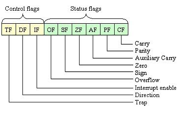

summary: Laboratorio 02 - Operaciones Aritméticas en Ensamblador x86
id: laboratorio-02-arquitectura
categories: Ensamblador
status: Published
authors: Oscar Menjivar

# Laboratorio 2: Operaciones Aritméticas en Ensamblador x86

> **Autor:** Oscar Menjivar  
> **Categorías:** Ensamblador · Arquitectura x86 · Aritmética

## Objetivos

En este laboratorio exploraremos cómo el procesador maneja la aritmética a bajo nivel. Al terminarlo, habremos logrado:

*   Comprender qué son los _flags_ del procesador y cómo las operaciones aritméticas los afectan.
*   Aplicar las instrucciones de suma (`ADD`, `ADC`), resta (`SUB`, `SBB`), multiplicación (`MUL`, `IMUL`) y división (`DIV`, `IDIV`) en sus variantes de 8 y 16 bits.
*   Entender la diferencia entre operaciones con y sin signo, y cuándo usar cada variante.
*   Estructurar nuestros programas mediante subrutinas (`CALL` / `RET`) para separar responsabilidades y reutilizar código.

---

## Las flags del procesador

Podemos pensar en las flags como señales que el procesador enciende o apaga automáticamente después de cada operación para comunicarnos información adicional.

Cada vez que la ALU ejecuta una operación aritmética, no solo produce un resultado numérico, sino que también actualiza un registro especial llamado **registro de flags** (o registro de estado). Este registro nos describe características del resultado que acabamos de calcular.



Los cuatro flags más relevantes para nuestro trabajo en aritmética son:

| Flag | Nombre completo | Activación                                                                                                |
| ---- | --------------- | --------------------------------------------------------------------------------------------------------- |
| `ZF` | _Zero Flag_     | El resultado de la operación es exactamente cero                                                          |
| `SF` | _Sign Flag_     | El bit más significativo del resultado es 1, lo que indica un número negativo en representación con signo |
| `OF` | _Overflow Flag_ | El resultado excede el rango representable con signo                                                      |
| `CF` | _Carry Flag_    | Hubo un acarreo (en suma) o un préstamo (en resta) que no cabe en el registro destino                     |

---

## Operaciones de Suma (ADD y ADC)

### Suma simple — `ADD`

La instrucción `ADD` suma dos operandos y guarda el resultado en el destino. Si el resultado no cabe en el registro destino, el exceso activa el _Carry Flag_.

```nasm
ADD destino, fuente   ; destino = destino + fuente
```

**Para 8 bits** — el resultado queda en `AL`. En este ejemplo, sumaremos **5** y **3**:

```nasm
MOV AL, 5
MOV BL, 3
ADD AL, BL    ; resultado en AL
```

**Para 16 bits** — el resultado queda en `AX`. En este ejemplo, sumaremos **210** y **15**:

```nasm
MOV AX, 210
MOV BX, 15
ADD AX, BX    ; resultado en AX
```

### Conceptos clave: El Acarreo

(Para ejemplificarlo usaremos un registro de 8 bits pero el mismo concepto es aplicable a registros de 16 o 32 bits)

Un registro de 8 bits puede guardar valores entre 0 y 255. Cuando una operación que realizamos produce un resultado fuera de ese rango, el procesador no puede mostrarlo completo. Para no perder esa información, activa el **Carry Flag** (`CF`).

**Acarreo en la suma** — cuando el resultado supera el límite superior.

Imaginemos que sumamos 200 + 100. El resultado correcto es 300, pero 300 no cabe en 8 bits. Lo que ocurre es que el registro solo guarda los 8 bits más bajos del resultado, que corresponden a 44. El "1" sobrante se registra en el Carry Flag:

```
200 + 100 = 300  →  el registro guarda 44, y CF = 1
```

Pensémoslo así: 300 en binario son 9 bits. Un registro de 8 bits solo alcanza para los 8 últimos. El bit noveno (el que "sobra") es exactamente el Carry Flag.

### Suma con acarreo — `ADC`

Cuando los números que queremos sumar son más grandes que un solo registro, necesitamos operar en partes. La suma de las partes bajas puede generar un acarreo que debemos trasladar a la suma de las partes altas. `ADC` recoge ese acarreo automáticamente:

```nasm
ADC destino, fuente   ; destino = destino + fuente + CF
```

Es importante que limpiemos el `CF` con `CLC` antes de comenzar, para evitar que un acarreo residual de una operación anterior contamine nuestro resultado.

**Para 8 bits** — En este ejemplo, queremos realizar la suma de 100d + 200d sobre los registros `AH:AL`:

```nasm
; Pasar el número a hexadecimal
; 100d -> 0064h
; 200d -> 00C8h

; Dividir en partes bajas y altas

; Partes bajas
MOV AL, 64h
MOV BL, 0C8h

; Partes altas
MOV AH, 00h
MOV BH, 00h

; Sumar partes bajas
ADD AL, BL

; Sumar partes altas aprovechando la CF
ADC AH, BH ;Resultado en AX (AH:AL)
```

**Suma de 16 bits usando registros de 8 bits** — En este ejemplo, sumaremos dos números de 16 bits (**12FFh + 0101h**) operando sus partes por separado. Cuando las partes bajas sumen más de 255, el `ADC` pasará ese "1" extra a la parte alta:

```nasm
; Número 1: 12FFh (Alta: 12h, Baja: FFh)
; Número 2: 0101h (Alta: 01h, Baja: 01h)

; 1. Cargamos las partes bajas
MOV AL, 0FFh
MOV BL, 01h

; 2. Cargamos las partes altas
MOV AH, 12h
MOV BH, 01h

; 3. Sumamos las partes bajas con ADD
ADD AL, BL        ; FFh + 01h = 00h. AL se queda en 0 y se activa el acarreo (CF = 1)

; 4. Sumamos las partes altas con ADC
ADC AH, BH        ; AH = 12h + 01h + CF(1) = 14h
                  ; El resultado final queda en AX: 1400h
```

> 💡 Si usáramos `ADD` en el segundo paso en lugar de `ADC`, perderíamos el acarreo de la primera suma y nuestro resultado sería incorrecto.

---

## Operaciones de Resta (SUB y SBB)

### Resta simple — `SUB`

`SUB` resta la fuente del destino y guarda el resultado en el destino. Si el destino es menor que la fuente en aritmética sin signo, la operación necesita un préstamo que activa el _Carry Flag_.

```nasm
SUB destino, fuente   ; destino = destino - fuente
```

**Para 8 bits** — el resultado queda en `AL`. En este ejemplo, restaremos **5 - 3**:

```nasm
MOV AL, 5
MOV BL, 3
SUB AL, BL    ; resultado en AL
```

**Para 16 bits** — el resultado queda en `AX`. En este ejemplo, restaremos **3200 - 1000**:

```nasm
MOV AX, 3200d
MOV BX, 1000d
SUB AX, BX    ; resultado en AX
```

### Conceptos clave: El Préstamo

**Préstamo en la resta** — cuando el resultado cae por debajo del límite inferior.

Ahora imaginemos restar 50 - 80. El resultado correcto es -30, pero en aritmética sin signo los negativos no existen. Lo que hace el procesador es interpretar ese "retroceso" como una vuelta circular: el registro llega a 0 y sigue contando hacia atrás desde 255, 254, 253… hasta posicionarse en 226. El Carry Flag se activa para indicarnos que se necesitó ese préstamo:

```
50 - 80 = -30  →  el registro guarda 226, y CF = 1
```

### Resta con préstamo — `SBB`

De manera simétrica a `ADC`, `SBB` extiende `SUB` para restar números que no caben en un solo registro. Incorpora el _Carry Flag_ como bit de préstamo de la operación anterior:

```nasm
SBB destino, fuente   ; destino = destino - fuente - CF
```

Internamente, la resta con préstamo se realiza sumando el complemento a dos del sustraendo, por lo que `SBB` combina ese mecanismo con el préstamo del `CF`.

**Para 8 bits** — En este ejemplo, queremos realizar la resta de **50d - 80d** sobre los registros `AH:AL`:

```nasm
; Pasar los números a hexadecimal
; 50d  -> 0032h
; 80d  -> 0050h

; Partes bajas
MOV AL, 32h       ; 50d
MOV BL, 50h       ; 80d

; Partes altas
MOV AH, 00h
MOV BH, 00h

; 1. Restamos las partes bajas con SUB
SUB AL, BL        ; 50 - 80 = -30. AL se queda con E2h (226) y se activa el préstamo (CF = 1)

; 2. Restamos las partes altas con SBB
SBB AH, BH        ; AH = 00h - 00h - CF(1) = FFh
                  ; El resultado final queda en AX: FFE2h (-30 en decimal)
```

---

## Multiplicación (MUL e IMUL)

### Multiplicación sin signo — `MUL`

`MUL` trata ambos operandos como **números sin signo** y siempre usa un registro implícito como primer factor: `AL` para operandos de 8 bits, `AX` para operandos de 16 bits. El resultado ocupa el doble de espacio que los factores, porque el producto de dos números de N bits puede requerir hasta 2N bits.

```nasm
MUL fuente   ; multiplica fuente por AL o AX (según tamaño)
```

**Para 8 bits** — el resultado queda en `AX`. En este ejemplo, multiplicaremos **220 × 2**:

```nasm
MOV AL, 220d
MOV BL, 2d
MUL BL        ; resultado en AX
```

**Para 16 bits** — el resultado queda en `DX:AX`. En este ejemplo, multiplicaremos **4200 × 44**:

```nasm
MOV AX, 4200d
MOV BX, 44d
MOV DX, 0     ; limpiamos DX para evitar datos residuales en la parte alta
MUL BX        ; resultado en DX:AX
```

> 💡 Es recomendable limpiar `DX` con `MOV DX, 0` antes de una multiplicación de 16 bits, para que la parte alta de nuestro resultado no contenga datos residuales.

### Multiplicación con signo — `IMUL`

`IMUL` (_Integer Multiply_) es la versión con signo de `MUL`. Interpreta los operandos como números en complemento a dos, lo que nos permite manejar valores negativos correctamente. Su sintaxis es idéntica a `MUL`:

```nasm
IMUL fuente   ; multiplica fuente por AL o AX, considerando el signo
```

**Para 8 bits** — el resultado queda en `AX`. En este ejemplo, multiplicaremos **-8 × 40**:

```nasm
MOV AL, -8d
MOV BL, 40d
IMUL BL       ; resultado en AX
```

**Para 16 bits** — el resultado queda en `DX:AX`. En este ejemplo, multiplicaremos **-4200 × 44**:

```nasm
MOV AX, -4200d
MOV BX, 44d
MOV DX, 0     ; limpiar DX si es necesario
IMUL BX       ; resultado en DX:AX
```

> ⚠️ Usar `MUL` con valores negativos produce resultados incorrectos, porque `MUL` interpreta el patrón de bits como un número positivo grande. Si alguno de nuestros factores puede ser negativo, debemos usar siempre `IMUL`.

---

## División (DIV e IDIV)

### División sin signo — `DIV`

La división requiere que coloquemos el dividendo en el registro correcto antes de ejecutarla. Produce **dos resultados**: el cociente y el residuo, guardados en registros separados.

```nasm
DIV fuente   ; divide el dividendo implícito entre fuente
```

**Para 8 bits** — el dividendo se coloca en `AX`. En este ejemplo, dividiremos **254 / 2**:

```nasm
MOV AL, 254d
MOV BL, 2d
DIV BL        ; AL = cociente, AH = residuo
```

**Para 16 bits** — el dividendo se coloca en `DX:AX`. En este ejemplo, dividiremos **3200 / 282**:

```nasm
MOV AX, 3200d
MOV BX, 282d
MOV DX, 0     ; Limpiar DX para asegurar que el dividendo es solo AX
DIV BX        ; AX = cociente, DX = residuo
```

> ⚠️ **Dos errores que detienen nuestro programa:**
>
> 1. **División por cero** — el procesador lanza una interrupción de error inmediatamente.
> 2. **Cociente demasiado grande** — si el cociente no cabe en el registro destino (AL para 8 bits, AX para 16 bits), también se genera una interrupción.

### División con signo — `IDIV`

`IDIV` (_Integer Divide_) es la versión con signo de `DIV`. Interpreta los dividendos y divisores como números con signo, permitiendo obtener cocientes negativos.

**Para 8 bits** — En este ejemplo, dividiremos **254 / -2**. El dividendo debe estar preparado en `AX`:

```nasm
MOV AL, 254d
CBW           ; extiende el signo de AL hacia AH (para tener el dividendo correcto en AX)
MOV BL, -2d
IDIV BL       ; AL = cociente, AH = residuo
```

> ⚠️ Usar `DIV` con dividendos o divisores negativos produce resultados incorrectos. Si alguno de nuestros operandos puede ser negativo, debemos usar siempre `CBW` + `IDIV`.

---

## Subrutinas (CALL y RET)

### Estructurar nuestro código con subrutinas

Conforme nuestros programas crecen, conviene separar las operaciones en bloques reutilizables llamados **subrutinas**. En ensamblador lo logramos con el par `CALL` / `RET`:

*   **`CALL nombre`** — salta a la subrutina y guarda automáticamente en la pila la dirección de la instrucción siguiente (la _dirección de retorno_).
*   **`RET`** — extrae esa dirección de la pila y regresa exactamente al punto donde ejecutamos el `CALL`.

```nasm
    CALL mi_subrutina      ; salta y guarda la dirección de retorno
    ; la ejecución continúa aquí cuando RET se ejecute

mi_subrutina:
    ; operaciones
    RET                    ; regresa al CALL
```

`CALL` y `RET` siempre van en pareja. Un `RET` sin su `CALL` correspondiente extraerá un valor incorrecto de la pila y nuestro programa fallará.

---

## Práctica Guiada

### Cálculo de promedio entero

**Descripción:** Desarrollaremos un programa que calcule el promedio entero de tres números (**8**, **15** y **9**). Utilizaremos una estructura modular basada en subrutinas para limpiar el estado del procesador, realizar la suma acumulada y obtener el promedio final.

**Requisitos:**

*   **Limpieza de registros:** Implementar una subrutina `clean` que ponga en cero los registros de propósito general (`AX`, `BX`, `CX`, `DX`) antes de iniciar.
*   **Definición de valores:** Cargar los números 8, 15 y 9 en los registros `BL`, `CL` y `DL` respectivamente.
*   **Subrutina de suma:** Implementar una subrutina `suma` que acumule la suma de los tres registros en el acumulador `AL`.
*   **Subrutina de promedio:** Implementar una subrutina `promedio` que realice la división del total acumulado entre 3 (usando el registro `BH` como divisor). El cociente final debe quedar en `AL`.
*   **Flujo principal:** El `main` debe coordinar las llamadas en el orden: `clean`, carga de datos, `suma` y `promedio`. Finalizar con `INT 20H`.

---

## Tabla de referencia rápida

### Suma y resta

| Instrucción           | Operación               | Resultado |
| --------------------- | ----------------------- | ------------------------- |
| `ADD destino, fuente` | `destino + fuente`      | `destino`                 |
| `ADC destino, fuente` | `destino + fuente + CF` | `destino`                 |
| `SUB destino, fuente` | `destino - fuente`      | `destino`                 |
| `SBB destino, fuente` | `destino - fuente - CF` | `destino`                 |

### Multiplicación

| Instrucción | Tamaño Operando | Operación (Factor fijo × Fuente) | Resultado |
| :--- | :--- | :--- | :--- |
| `MUL / IMUL fuente` | 8 bits | `AL × fuente` | `AX` |
| | 16 bits | `AX × fuente` | `DX:AX` |

### División

| Instrucción | Tamaño Operando | Operación (Dividendo ÷ Fuente) | Cociente | Residuo | Preparación requerida |
| :--- | :--- | :--- | :--- | :--- | :--- |
| `DIV / IDIV fuente` | 8 bits | `AX ÷ fuente` | `AL` | `AH` | `AH=0` (sin signo) o `CBW` (con signo) |
| `DIV fuente` | 16 bits | `DX:AX ÷ fuente` | `AX` | `DX` | Limpiar `DX` (`MOV DX, 0`) |

### Utilidades y control de flujo

| Instrucción   | Descripción                                                             |
| ------------- | ----------------------------------------------------------------------- |
| `CLC`         | Pone `CF = 0`; usar antes de operaciones `ADC` / `SBB` encadenadas      |
| `CBW`         | Extiende el signo de `AL` hacia `AH`; necesario antes de `IDIV` de 8 bits |
| `CALL nombre` | Salta a la subrutina y guarda la dirección de retorno en la pila        |
| `RET`         | Extrae la dirección de retorno de la pila y regresa al punto del `CALL` |

---

## Ejercicios e Indicaciones de entrega

### Ejercicio 1 — Área y perímetro de un rectángulo

**Descripción:** Implementaremos un programa que calcule el área y el perímetro de un rectángulo con dimensiones predefinidas (ancho = 12, alto = 7). El objetivo es aplicar una estructura modular con subrutinas para la carga de datos y los cálculos matemáticos, almacenando los resultados obtenidos en direcciones específicas de memoria.

**Requisitos:**

- **Carga de datos:** Implementar una subrutina `cargar_datos` que asigne los valores iniciales (12 para el ancho y 7 para el alto) a los registros `AL` y `BL` respectivamente.
- **Subrutina de Área:**
  - Crear la función `calc_area` que calcule `ancho × alto` utilizando la instrucción `MUL`.
  - El resultado final debe quedar en `AX`.
  - El `main` debe invocar esta subrutina y guardar el valor en la dirección `[200H]`.
- **Subrutina de Perímetro:**
  - Crear la función `calc_perimetro` que realice el cálculo `2 × (ancho + alto)`.
  - Puedes utilizar un registro auxiliar (como `CL`) para almacenar el factor 2 antes de multiplicar.
  - El `main` debe invocar esta subrutina y guardar el valor resultante en la dirección `[202H]`.
- **Flujo del programa:** El `main` debe coordinar las llamadas secuencialmente, asegurándose de que los registros tengan los valores correctos antes de realizar cada cálculo (recuerda que instrucciones como `MUL` modifican el registro `AX`).

### Ejercicio 2 — Factura con descuento

**Descripción:** Simularemos un sistema de facturación que aplica un descuento del 15% a un subtotal predefinido (240). El programa calculará tanto el monto del descuento como el total final a pagar, empleando una estructura modular de subrutinas y persistiendo los resultados en memoria.

**Requisitos:**

- **Limpieza inicial:** Implementar una subrutina `clean` que ponga en cero los registros `AX`, `BX`, `CX` y `DX` antes de realizar cualquier operación.
- **Subrutina de Descuento:**
  - Crear la función `calc_descuento` que aplique la fórmula: `(subtotal × 15) / 100`.
  - El resultado del descuento debe quedar en el registro `AL`.
- **Subrutina de Total:**
  - Crear la función `calc_total` que reste el monto del descuento al subtotal original.
  - El resultado del total a pagar debe quedar en el registro `BX`.
- **Subrutina de Almacenamiento:**
  - Crear la función `guardar_resultados` que escriba los valores finales en memoria:
    - Descuento en la dirección `[300H]`.
    - Total final en la dirección `[302H]`.
- **Flujo principal:** El `main` coordinará las llamadas en este orden: `clean`, carga del subtotal (240) en `AX`, `calc_descuento`, `calc_total` y `guardar_resultados`.

---

### Indicaciones de entrega

Los ejercicios realizados en este laboratorio deben entregarse a través de la plataforma **Moodle**. Por favor, asegúrate de cumplir con los siguientes requisitos:

1.  Ubicar el entregable bajo el nombre **"Labo 2 (Sección x)"**.
2.  Subir cada archivo de código fuente en su respectiva sección.
3.  El formato de nombre de los archivos debe ser estrictamente el siguiente:
    *   **Ejercicio 1:** `uno[NombreApellido].asm` (Ejemplo: `unoOscarMenjivar.asm`)
    *   **Ejercicio 2:** `dos[NombreApellido].asm` (Ejemplo: `dosOscarMenjivar.asm`)
